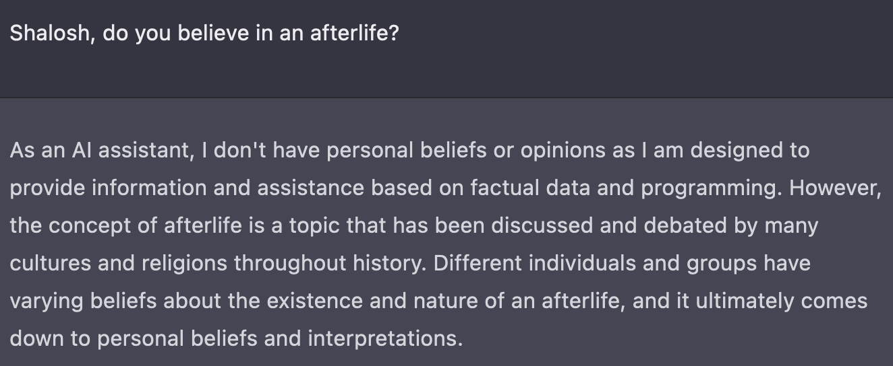

I don't believe in an afterlife. So in my mind, we all only get one shot. A single lifetime of roughly 80 years, ending with a disintegration of our molecules into their oxidized components, whether sped up by fire, digestive enzymes, or slowed down by embalming or dehydration. Either way, the "me" and the "you" will cease to exist.

So then, what, if anything can be the point of this life? This brief speck in time where the molecules in our brain decided, or were deluded into thinking, that we were conscious? It's not even clear that we have any true free will. Just like a mathematical model responding to its inputs, but the random and the not, our brains may in fact be simply calculating the results of the chemical reactions that our molecules experience. Indeed, we may be simply passengers, watching a beautiful 4D movie.

But even then, perhaps there is still a purpose for us being here. If indeed there is only a single lifetime to be had, with no rewards nor consequences in the hereafter, then it's hard to say that any particular life goals or purposes are completely incorrect.

But still, after some thought, here are mine:

1. Associate with great people
2. Support family, friends and the larger community
3. Constructing something successful and unique
4. Exploration and learning

And just as importantly I think there are a few things that I don't long for:

1. Buying a large number of possessions
2. Huge amounts of happiness or misery

Allow me to explain:

First off, I grew up in the Confucianist tradition. I don't claim to be a scholar by any means, having never read the Analects or really any of the great works. But for those of us who grew up in it, it's in our bones, and is as removable as the marrow.

In the Confucianist tradition, there's an archetype one should aspire to: that of the junzi. Roughly translated as a prince or noble, the general idea is that a junzi, through superior education and ethics, is a force for order and harmony and prosperity in society.